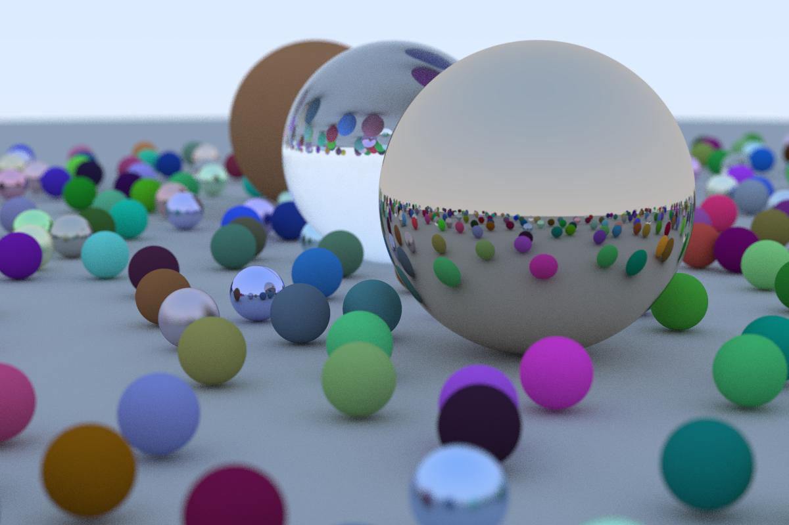

# 抄轮子
使用Rust重写了[The Ray Tracing in One Weekend series of books](https://raytracing.github.io/)
## 第一本
https://github.com/thomation/rePleuX/releases/tag/v0.1.0

128spp，结果可以接受

## 第二本
https://github.com/thomation/rePleuX/releases/tag/v0.2.0

128spp，多线程渲染了4个小时，噪点还是太多。只能等用蒙特卡洛来改进了。

## 第三本
https://github.com/thomation/rePleuX/releases/tag/v0.3.0

500spp, 20分钟。

